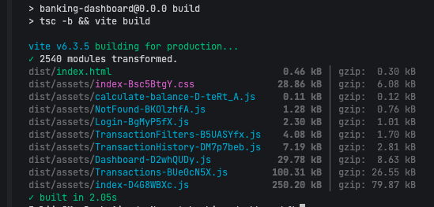
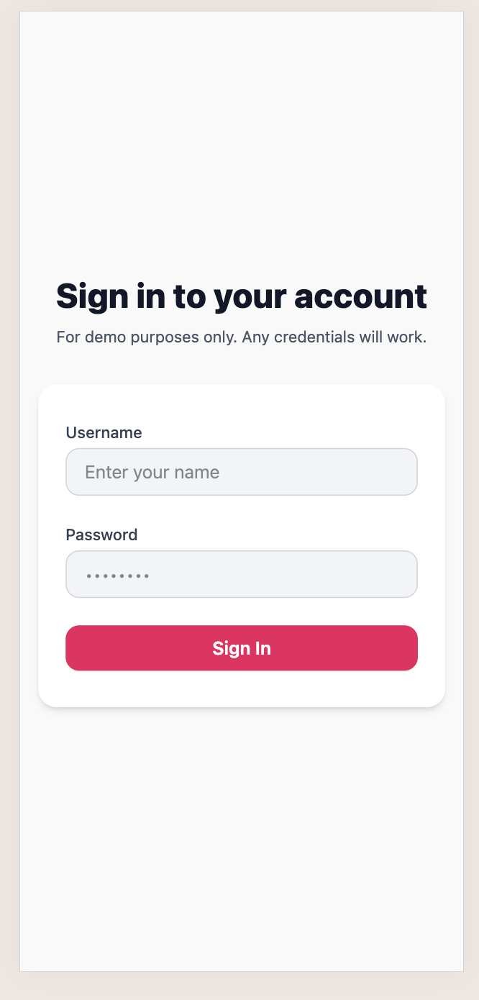
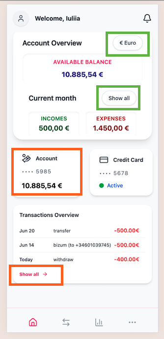
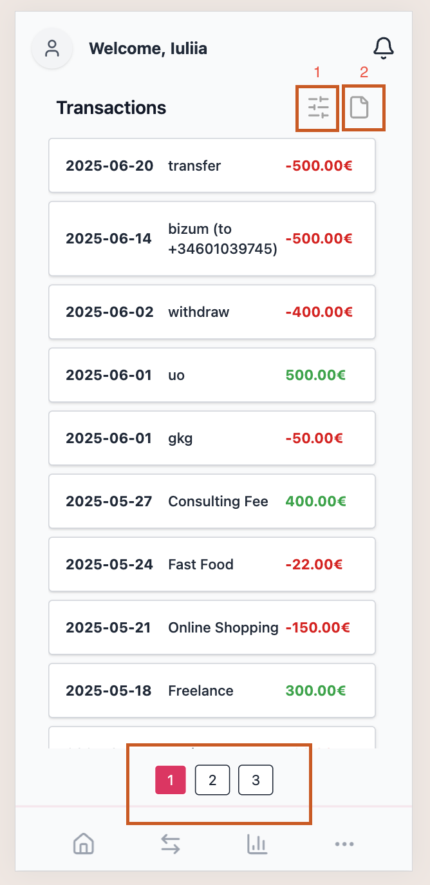
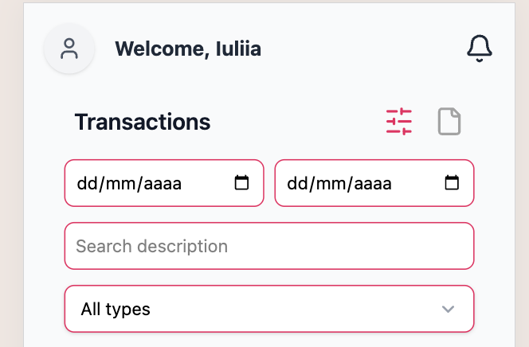
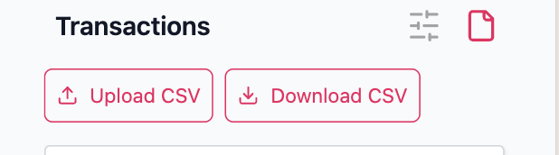
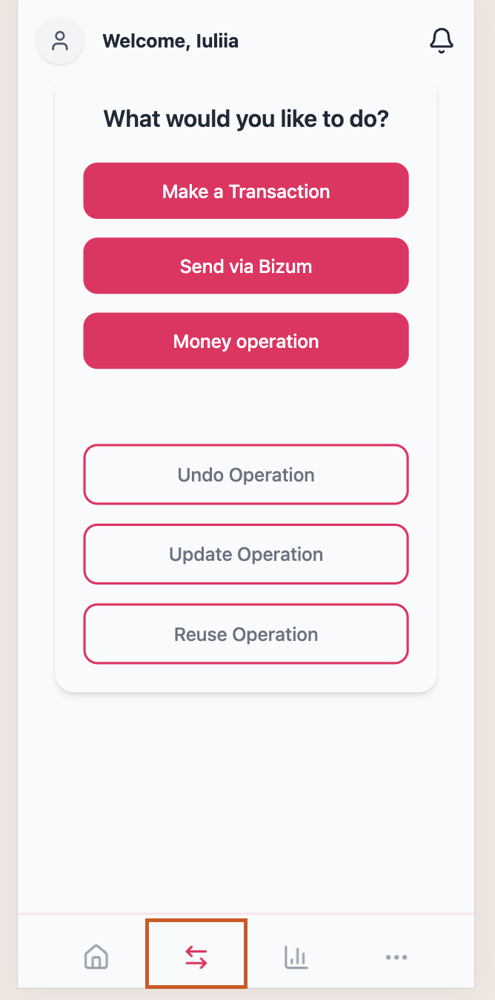

# Banking Dashboard

A modern React-based banking dashboard application built with Vite, TypeScript, and Tailwind CSS. This application provides a user interface for viewing account information, transactions, and managing banking activities.

## Features

- Account Overview
- Transaction History
- Currency Conversion (EUR/USD)
- Responsive Design
- Real-time Data Updates

## Tech Stack

- React 19
- TypeScript
- Vite
- Tailwind CSS
- Vitest for Testing
- React Hook Form
- Date-fns
- Lucide React Icons

## Prerequisites

- Node.js (Latest LTS version recommended)
- npm

## Getting Started

1. Clone the repository:
```bash
git clone https://github.com/IuliiaNova/banking-dashboard.git
cd banking-dashboard
```

2. Install dependencies:
```bash
npm install
```

3. Start the development server:
```bash
npm run dev
```

## Available Scripts

- `npm run dev` - Start development server
- `npm run build` - Build for production
- `npm run preview` - Preview production build
- `npm run test` - Run tests with coverage
- `npm run lint` - Run ESLint

## Project Structure

```
src/
├── __tests__/          # Test files
├── app/                # App configuration and global styles
├── entities/           # Domain entities and models
├── features/           # Feature-based modules
│   ├── account/
│   ├── login/
│   └── transactions/
├── pages/             # Page components
├── shared/            # Shared utilities and components
└── widgets/           # Reusable widget components
```

## Testing

The project uses Vitest for testing. Tests are located in the `src/__tests__` directory. Run tests with:

```bash
npm run test
```

For watch mode:
```bash
npm run test -- --watch
```     

### Build



## User Journey 🚀

**1. Login**

On the login screen, you can enter any credentials (username and password). There is no actual authentication – any input will work. When you log in, the app saves the username in the browser’s localStorage. This simulates a basic authentication flow.




**2. Dashboard**

After logging in, you’ll be redirected to the dashboard. Your saved username will be displayed in a header.

At this view user can:

a. <ins>Select App Currency</ins>

Choose the app’s currency: Euro (EUR) or Dollar (USD).
The default currency is Euro.
The selected currency is highlighted in green (see screenshot).

b. <ins>Account Overview</ins>

View your income and expenses.
By default, values for the current month are shown.
You can switch to view total income and expenses (all time).
The current selection (month or total) is highlighted in green (see screenshot).

c. <ins>Navigation to Transactions histori</ins>

Click the ‘Account’ menu item to go to the full Transactions view.
Or, in the ‘Transactions Overview’ section, click ‘Show All’ to view the complete list of transactions.



**2. Transactions list**

On the Transactions history page, users can:

a. <ins>View a List of Transactions</ins>
- Transactions are displayed in a list, ordered by most recent date first.
- The list is paginated, showing 20 items per page for easy navigation.

***Mock Data Source***

On the first load, transaction data is fetched from a mock JSON document.
After the first load, transactions are saved in localStorage. This ensures that data is persisted and users will not lose their transaction list even after refreshing the page (F5).



b. <ins>Filters of Transactions list</ins>

Filter Button (1 marked in the screenshot) Clicking this button opens the available filters:
- Date range: Filter by start and end date.
- Operation type: Filter by the type of transaction.
- Description: Filter by description keyword.



b. <ins>Upload/Download CSV of Transactions list</ins>

CSV Import/Export Button (2 marked in the screenshot). This button will show a user buttons to upload or download transactions in CSV format.

***Upload:***

You can upload a CSV document containing your transactions. 
The app only accepts files in CSV format.
When importing, the app checks for duplicate transactions based on the id field.
If the uploaded document does not contain an id column, the app will generate unique IDs for each transaction automatically.

⚠️ Important:

Duplicate checks are done only using the id field.
Comparing just the description or date is not reliable and is not used for duplicate detection.

***Download:***

You can export your transactions as a CSV file at any time.




**3. Transactions Action**

The Transactions page lets you manage your financial operations.
At the bottom (footer), you’ll find an arrow icon (see screenshot) that opens the actions menu.

***Available Actions 💸***

1. <ins>Make a Transfer:</ins>

- Create a **new transfer** transaction: You can select any date for the transfer start from today,
- Send Money via **Bizum**: The date is automatically set to today and cannot be changed.
- Cash Operations (**Withdraw or Deposit money**): The date is automatically set to today and cannot be changed.
- Undo Operation: It is possible Undo any transaction. _Recommended_: Only allow undo for transactions made today.
- Update Operation_ User can update a transaction’s date or description.
- Repeat Operation: Quickly repeat an existing transaction with the same details.

**How ↩️ Undo, ✏️ Update, 🔁 Repeat transactions**

1. Select Undo, Update, or Repeat from the actions menu.
2. You are taken to a page listing all your transactions.
3. Use the filters to quickly find the transaction you want.
4. Click the desired transaction to open a modal with a specific form:

_Undo_: Confirm that you want to undo the operation.

_Update_: Edit the date and/or description.

_Repeat_: Review the details before repeating the transaction.

5. After confirming: The transaction list updates immediately. You are redirected back to the main transactions list. A confirmation alert is shown for the completed action.



### 💬 Contact

For questions, suggestions, or feedback, feel free to reach out via GitHub Issues.

###  ⭐️ Support

If you like this project, please consider starring ⭐️ the reposito